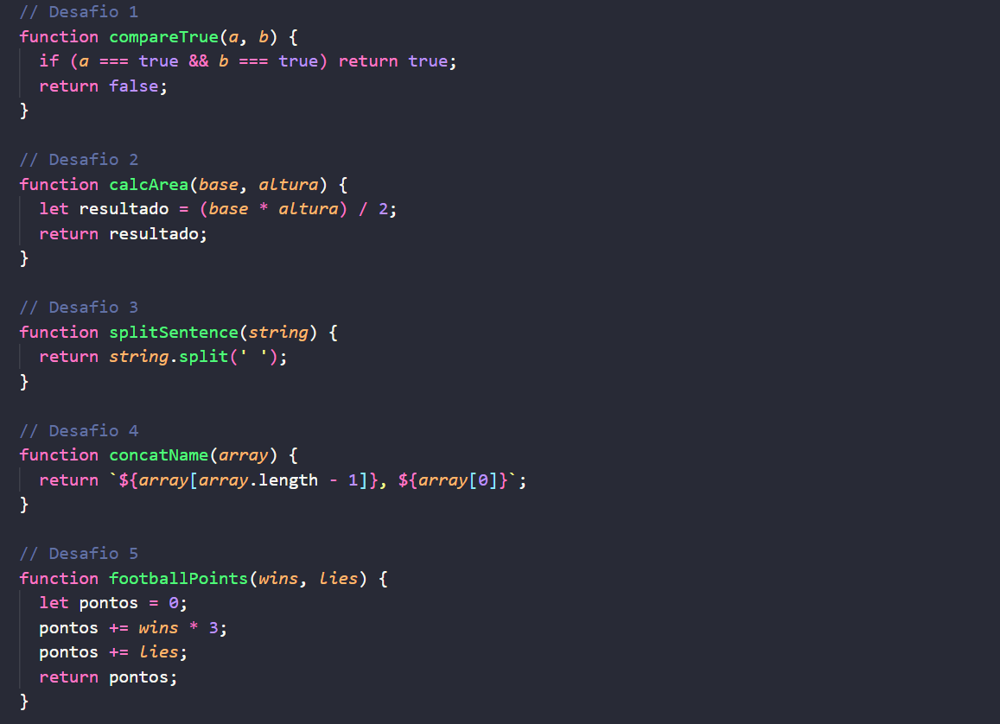

<h1>Projeto Playground Functions</h1>

<h3>Descrição:</h3>

Nesse projeto foram desenvolvidas 13 funções com propostas diferentes... calcular a área de um triângulo, comparar resultados, formar objetos com dados recebidos, calcular pontos... etc.

<h3>Oque eu aprendi?</h3>
<ul>
  <li>Lógica De Programação</li>
  <li>Como escrever funções em Java Script</li>
  <li>Entendendo as regras de negócio</li>
</ul>

Data do projeto: 09/12/2021

